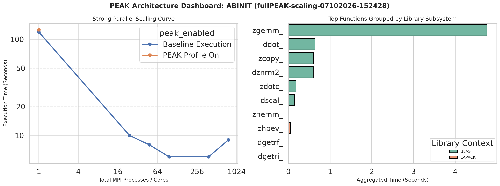
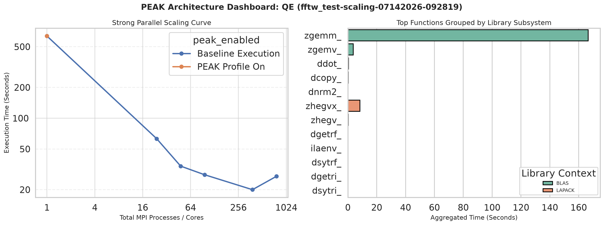

# Data and Plots

## Results

### Results Overview

| Program | Best Scaling | Dominant Function (by time) |
| --- | --- | --- |
| ABINIT | 384 Tasks (8 Nodes) | `zgemm_` |
| Quantum Expresso | 384 Tasks (8 Nodes) | `zgemm_` |
| LAMMPS | 24 Tasks (1 Node) | N/A |
| GROMACS | 768 Tasks (16 Nodes) | N/A |
| DFTB+ | 1 Task (1 Node) | `dsyev_` |

### ABINIT

*Simulates how electrons and atoms behave in materials, using quantum mechanics to predict a material's structure, energy, and properties.*

| Job Name | Config | Nodes | Tasks | PEAK? | Elapsed (s) | Exit Code | Job ID |
| --- | --- | --- | --- | --- | --- | --- | --- |
| `abinit_test_n1_nopeak` | `n1_nopeak` | 1 | 1 | No | **119** | 0 | 3294914 |
| `abinit_test_n24_nopeak` | `n24_nopeak` | 1 | 24 | No | **10** | 0 | 3294915 |
| `abinit_test_n48_nopeak` | `n48_nopeak` | 1 | 48 | No | **8** | 0 | 3294916 |
| `abinit_test_N2_nopeak` | `N2_nopeak` | 2 | 96 | No | **6** | 0 | 3294917 |
| `abinit_test_N8_nopeak` | `N8_nopeak` | 8 | 384 | No | **6** | 0 | 3294918 |
| `abinit_test_N16_nopeak` | `N16_nopeak` | 16 | 768 | No | **9** | 0 | 3294919 |
| `abinit_test_n1_peak` | `n1_peak` | 1 | 1 | Yes | **126** | 0 | 3294920 |

| Function | Calls | Total Time (s) | Avg Time / Call (ms) | PEAK Overhead (s) |
| --- | --- | --- | --- | --- |
| `zgemm_` | 207,990 | **4.7613** | 0.0229 | 0.4258 |
| `ddot_` | 216,544 | **0.6383** | 0.0029 | 0.4433 |
| `zcopy_` | 131,022 | **0.6081** | 0.0046 | 0.2682 |
| `dznrm2_` | 116,280 | **0.5958** | 0.0051 | 0.2380 |
| `zdotc_` | 51,588 | **0.1846** | 0.0036 | 0.1056 |

### Quantum Expresso

*Another quantum-mechanical materials simulation package, solving the same kind of problem as ABINIT with a different underlying computational method.*

| Job Name | Config | Nodes | Tasks | PEAK? | Elapsed (s) | Exit Code | Job ID |
| --- | --- | --- | --- | --- | --- | --- | --- |
| `qe_tc_n1_nopeak` | `n1_nopeak` | 1 | 1 | No | **636** | 0 | 3306688 |
| `qe_tc_n24_nopeak` | `n24_nopeak` | 1 | 24 | No | **63** | 0 | 3306689 |
| `qe_tc_n48_nopeak` | `n48_nopeak` | 1 | 48 | No | **34** | 0 | 3306690 |
| `qe_tc_N2_nopeak` | `N2_nopeak` | 2 | 96 | No | **28** | 0 | 3306691 |
| `qe_tc_N8_nopeak` | `N8_nopeak` | 8 | 384 | No | **20** | 0 | 3306692 |
| `qe_tc_N16_nopeak` | `N16_nopeak` | 16 | 768 | No | **27** | 0 | 3306693 |
| `qe_tc_n1_peak` | `n1_peak` | 1 | 1 | Yes | **638** | 0 | 3306694 |

| Function | Calls | Total Time (s) | Avg Time / Call (ms) | PEAK Overhead (s) |
| --- | --- | --- | --- | --- |
| `zgemm_` | 144,849 | **166.6082** | 1.1502 | 0.2227 |
| `zhegvx_` | 5,561 | **8.3896** | 1.5087 | 0.0085 |
| `zgemv_` | 1,184 | **3.7863** | 3.1979 | 0.0018 |
| `ddot_` | 57,984 | **0.3923** | 0.0068 | 0.0891 |
| `dcopy_` | 1,926 | **0.3207** | 0.1665 | 0.0030 |

### LAMMPS

*Simulates how large numbers of atoms and molecules move and interact over time (molecular dynamics), commonly used to study materials at the atomic scale.*

| Job Name | Config | Nodes | Tasks | PEAK? | Elapsed (s) | Exit Code | Job ID |
| --- | --- | --- | --- | --- | --- | --- | --- |
| `lammps_rhodo_n1_nopeak` | `n1_nopeak` | 1 | 1 | No | **32** | 0 | 3305579 |
| `lammps_rhodo_n24_nopeak` | `n24_nopeak` | 1 | 24 | No | **4** | 0 | 3305580 |
| `lammps_rhodo_n48_nopeak` | `n48_nopeak` | 1 | 48 | No | **4** | 0 | 3305581 |
| `lammps_rhodo_N2_nopeak` | `N2_nopeak` | 2 | 96 | No | **4** | 0 | 3305582 |
| `lammps_rhodo_N8_nopeak` | `N8_nopeak` | 8 | 384 | No | **4** | 0 | 3305583 |
| `lammps_rhodo_N16_nopeak` | `N16_nopeak` | 16 | 768 | No | **8** | 255 | 3305584 |
| `lammps_rhodo_n1_peak` | `n1_peak` | 1 | 1 | Yes | **32** | 0 | 3305585 |

> LAMMPS did not yield PEAK hits.

### GROMACS

*Simulates the motion and interactions of biomolecules like proteins and lipids, widely used to study biological and chemical processes.*

| Job Name | Config | Nodes | Tasks | PEAK? | Elapsed (s) | Exit Code | Job ID |
| --- | --- | --- | --- | --- | --- | --- | --- |
| `gromacs_benchMEM_n24_nopeak` | `n24_nopeak` | 1 | 24 | No | **213** | 0 | 3295859 |
| `gromacs_benchMEM_n48_nopeak` | `n48_nopeak` | 1 | 48 | No | **125** | 0 | 3295860 |
| `gromacs_benchMEM_n48_peak` | `n48_peak` | 1 | 48 | Yes | **126** | 0 | 3295864 |
| `gromacs_benchMEM_N2_nopeak` | `N2_nopeak` | 2 | 96 | No | **75** | 0 | 3295861 |
| `gromacs_benchMEM_N8_nopeak` | `N8_nopeak` | 8 | 384 | No | **37** | 0 | 3295862 |
| `gromacs_benchMEM_N16_nopeak` | `N16_nopeak` | 16 | 768 | No | **36** | 0 | 3295863 |

> GROMACS did not yield PEAK hits.

### DFTB+

*A faster, approximate alternative to full quantum-mechanical simulation, trading some accuracy for greatly reduced compute time.*

| Job Name | Config | Nodes | Tasks | PEAK? | Elapsed (s) | Exit Code | Job ID |
| --- | --- | --- | --- | --- | --- | --- | --- |
| `dftb_spinlock_n1_nopeak` | `n1_nopeak` | 1 | 1 | No | **120** | 0 | 3303873 |
| `dftb_spinlock_n24_nopeak` | `n24_nopeak` | 1 | 24 | No | **144** | 0 | 3303874 |
| `dftb_spinlock_n48_nopeak` | `n48_nopeak` | 1 | 48 | No | **220** | 0 | 3303875 |
| `dftb_spinlock_n1_peak` | `n1_peak` | 1 | 1 | Yes | **121** | 0 | 3303879 |
| `dftb_spinlock_N2_nopeak` | `N2_nopeak` | 2 | 96 | No | **2** | 1 | 3303876 |
| `dftb_spinlock_N8_nopeak` | `N8_nopeak` | 8 | 384 | No | **3** | 1 | 3303877 |
| `dftb_spinlock_N16_nopeak` | `N16_nopeak` | 16 | 768 | No | **3** | 1 | 3303878 |

| Function | Calls | Total Time (s) | Avg Time / Call (s) | PEAK Overhead (s) |
| --- | --- | --- | --- | --- |
| `dsyev_` | 4 | **94.1030** | 23.5258 | 0.0000 |
| `dgemm_` | 442 | **10.5098** | 0.0238 | 0.0007 |
| `dsymm_` | 4 | **10.0370** | 2.5092 | 0.0000 |
| `dlarrv_` | 4 | **0.1037** | 0.0259 | 0.0000 |
| `dcopy_` | 34,760 | **0.0280** | 0.0008 | 0.0541 |

## Discussion / Analysis

### ABINIT

- ABINIT scaled effectively from 1 to 384 tasks (119s → 6s), but performance degrades slightly at 768 tasks (9s), most likely due to inter-node communication overhead.
- As more resources are allocated, speedup drops off, and at the high end of scaling it even becomes less efficient.

### Quantum Expresso

- Similar story to ABINIT: QE scales well up to 384 tasks (636s → 20s), then degrades at 768 tasks (27s).

### LAMMPS

- LAMMPS plateaus fast (32s → 4s by 24 tasks) and stays flat through 384 tasks, before failing (exit code 255) at 768 tasks.
- The program or test case seems to impose a hard limit on what resources LAMMPS allows itself to attempt to use.
- Did not produce PEAK hits.

### GROMACS

- GROMACS scaled the best out of the group, successfully taking advantage of all the resources it was given.
- Did not produce PEAK hits.

### DFTB+

- DFTB+ performed worse with more resources on a single node (120s → 144s → 220s) and outright crashed (exit code 1) when multiple nodes were introduced.
- Root cause is not yet understood and needs further diagnosis (see Future Work).

