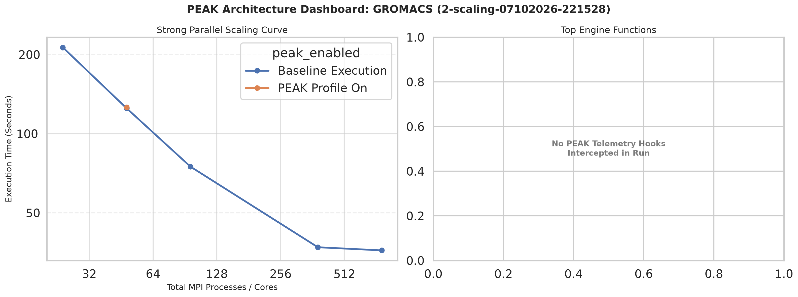

# Weekly Report

## What I Worked On

### Profiling

#### ABINIT

* **Path:** `abinit/v2/fullPEAK-scaling-07102026-152428/timing_summary.csv`

| Job Name | Config | Nodes | Tasks | PEAK? | Elapsed (s) | Exit Code | Job ID |
| --- | --- | --- | --- | --- | --- | --- | --- |
| `abinit_test_n1_nopeak` | `n1_nopeak` | 1 | 1 | No | **119** | 0 | 3294914 |
| `abinit_test_n24_nopeak` | `n24_nopeak` | 1 | 24 | No | **10** | 0 | 3294915 |
| `abinit_test_n48_nopeak` | `n48_nopeak` | 1 | 48 | No | **8** | 0 | 3294916 |
| `abinit_test_N2_nopeak` | `N2_nopeak` | 2 | 96 | No | **6** | 0 | 3294917 |
| `abinit_test_N8_nopeak` | `N8_nopeak` | 8 | 384 | No | **6** | 0 | 3294918 |
| `abinit_test_N16_nopeak` | `N16_nopeak` | 16 | 768 | No | **9** | 0 | 3294919 |
| `abinit_test_n1_peak` | `n1_peak` | 1 | 1 | Yes | **126** | 0 | 3294920 |

| Function | Calls | Total Time (s) | Avg Time / Call (ms) | PEAK Overhead (s) |
| --- | --- | --- | --- | --- |
| `zgemm_` | 207,990 | **4.7613** | 0.0229 | 0.4258 |
| `ddot_` | 216,544 | **0.6383** | 0.0029 | 0.4433 |
| `zcopy_` | 131,022 | **0.6081** | 0.0046 | 0.2682 |
| `dznrm2_` | 116,280 | **0.5958** | 0.0051 | 0.2380 |
| `zdotc_` | 51,588 | **0.1846** | 0.0036 | 0.1056 |

##### Takeaway

- ABINIT effectively scaled from 1 to 96 tasks but performs worse when scaled further on this test case.
- As I understand it, the decrease in speed up is most likely due to inter-node communication overhead.

#### Quantum Espresso

* **Path:** `qe/fftw_test-scaling-07142026-092819/timing_summary.csv`

| Job Name | Config | Nodes | Tasks | PEAK? | Elapsed (s) | Exit Code | Job ID |
| --- | --- | --- | --- | --- | --- | --- | --- |
| `qe_tc_n1_nopeak` | `n1_nopeak` | 1 | 1 | No | **636** | 0 | 3306688 |
| `qe_tc_n24_nopeak` | `n24_nopeak` | 1 | 24 | No | **63** | 0 | 3306689 |
| `qe_tc_n48_nopeak` | `n48_nopeak` | 1 | 48 | No | **34** | 0 | 3306690 |
| `qe_tc_N2_nopeak` | `N2_nopeak` | 2 | 96 | No | **28** | 0 | 3306691 |
| `qe_tc_N8_nopeak` | `N8_nopeak` | 8 | 384 | No | **20** | 0 | 3306692 |
| `qe_tc_N16_nopeak` | `N16_nopeak` | 16 | 768 | No | **27** | 0 | 3306693 |
| `qe_tc_n1_peak` | `n1_peak` | 1 | 1 | Yes | **638** | 0 | 3306694 |

| Function | Calls | Total Time (s) | Avg Time / Call (ms) | PEAK Overhead (s) |
| --- | --- | --- | --- | --- |
| `zgemm_` | 144,849 | **166.6082** | 1.1502 | 0.2227 |
| `zhegvx_` | 5,561 | **8.3896** | 1.5087 | 0.0085 |
| `zgemv_` | 1,184 | **3.7863** | 3.1979 | 0.0018 |
| `ddot_` | 57,984 | **0.3923** | 0.0068 | 0.0891 |
| `dcopy_` | 1,926 | **0.3207** | 0.1665 | 0.0030 |

##### Takeaway

- Similiar story to ABINIT

#### DFTB+

* **Path:** `dftb/new_gen-scaling-07132026-145728/timing_summary.csv`

| Job Name | Config | Nodes | Tasks | PEAK? | Elapsed (s) | Exit Code | Job ID |
| --- | --- | --- | --- | --- | --- | --- | --- |
| `dftb_spinlock_n1_nopeak` | `n1_nopeak` | 1 | 1 | No | **120** | 0 | 3303873 |
| `dftb_spinlock_n24_nopeak` | `n24_nopeak` | 1 | 24 | No | **144** | 0 | 3303874 |
| `dftb_spinlock_n48_nopeak` | `n48_nopeak` | 1 | 48 | No | **220** | 0 | 3303875 |
| `dftb_spinlock_n1_peak` | `n1_peak` | 1 | 1 | Yes | **121** | 0 | 3303879 |
| `dftb_spinlock_N2_nopeak` | `N2_nopeak` | 2 | 96 | No | **2** | 1 | 3303876 |
| `dftb_spinlock_N8_nopeak` | `N8_nopeak` | 8 | 384 | No | **3** | 1 | 3303877 |
| `dftb_spinlock_N16_nopeak` | `N16_nopeak` | 16 | 768 | No | **3** | 1 | 3303878 |

| Function | Calls | Total Time (s) | Avg Time / Call (s) | PEAK Overhead (s) |
| --- | --- | --- | --- | --- |
| `dsyev_` | 4 | **94.1030** | 23.5258 | 0.0000 |
| `dgemm_` | 442 | **10.5098** | 0.0238 | 0.0007 |
| `dsymm_` | 4 | **10.0370** | 2.5092 | 0.0000 |
| `dlarrv_` | 4 | **0.1037** | 0.0259 | 0.0000 |
| `dcopy_` | 34,760 | **0.0280** | 0.0008 | 0.0541 |

##### Takeaway

- DFTB+ seemingly performed worse as it scaled on this test case, even crashing on multi-node configurations.
- Im going to look into this one more as it doesn't make sense to me.

#### LAMMPS

* **Path:** `lammps/5-scaling-07132026-225745/timing_summary.csv`

| Job Name | Config | Nodes | Tasks | PEAK? | Elapsed (s) | Exit Code | Job ID |
| --- | --- | --- | --- | --- | --- | --- | --- |
| `lammps_rhodo_n1_nopeak` | `n1_nopeak` | 1 | 1 | No | **32** | 0 | 3305579 |
| `lammps_rhodo_n24_nopeak` | `n24_nopeak` | 1 | 24 | No | **4** | 0 | 3305580 |
| `lammps_rhodo_n48_nopeak` | `n48_nopeak` | 1 | 48 | No | **4** | 0 | 3305581 |
| `lammps_rhodo_N2_nopeak` | `N2_nopeak` | 2 | 96 | No | **4** | 0 | 3305582 |
| `lammps_rhodo_N8_nopeak` | `N8_nopeak` | 8 | 384 | No | **4** | 0 | 3305583 |
| `lammps_rhodo_N16_nopeak` | `N16_nopeak` | 16 | 768 | No | **8** | 255 | 3305584 |
| `lammps_rhodo_n1_peak` | `n1_peak` | 1 | 1 | Yes | **32** | 0 | 3305585 |

> LAMMPS did not yield any PEAK hits on both module and build script versions.

##### Takeaway

- LAMMPS scaled great, but seemingly limitted itself after an upper limit.
- As I understand it, this limit is based on the input and more complex input files will scale better.

#### GROMACS

* **Path:** `gromacs/2-scaling-07102026-221528/timing_summary.csv`

| Job Name | Config | Nodes | Tasks | PEAK? | Elapsed (s) | Exit Code | Job ID |
| --- | --- | --- | --- | --- | --- | --- | --- |
| `gromacs_benchMEM_n24_nopeak` | `n24_nopeak` | 1 | 24 | No | **213** | 0 | 3295859 |
| `gromacs_benchMEM_n48_nopeak` | `n48_nopeak` | 1 | 48 | No | **125** | 0 | 3295860 |
| `gromacs_benchMEM_n48_peak` | `n48_peak` | 1 | 48 | Yes | **126** | 0 | 3295864 |
| `gromacs_benchMEM_N2_nopeak` | `N2_nopeak` | 2 | 96 | No | **75** | 0 | 3295861 |
| `gromacs_benchMEM_N8_nopeak` | `N8_nopeak` | 8 | 384 | No | **37** | 0 | 3295862 |
| `gromacs_benchMEM_N16_nopeak` | `N16_nopeak` | 16 | 768 | No | **36** | 0 | 3295863 |

> GROMACS did not yield any PEAK hits on both module and build script versions.

##### Takeaway

- GROMACS seemingly takes great advantage of scaling.

### Created another script to parse research data and create graphs

## What I Learned

- Creating input files
- Working with QE, DFTB+, LAMMPS, and GROMACS
- Interpreting profiling data

## Questions / Concerns

- For cases where PEAK does not get any hits for BLAS, LAPACK, and FFTW. Is there anything else you would want me to do or try?
    - From what I've looked into, it may be due to the way these programs were compiled as for why I'm getting no hits.
- For DFTB+, I am using the spinlock case for testing. Is there a different test case I could use?

## Notes

PEAK_TARGET_CONFIG
N1,2,4 for DFTB+

### Poster Workshop

Can put OCU, TACC, NSF on poster
Bold own name / presenting name on poster
Bullet points > text, limited to what needs to be knowm, focused
Workflows, pictures, and graphs on poster
Results, focus on key results, not all results. Or most interesting
Future plans section
Referencs and acknowledgements section. Can use qr code to save space

Make things interactive or fun, eg: suggestion box for programs or some sort of game
