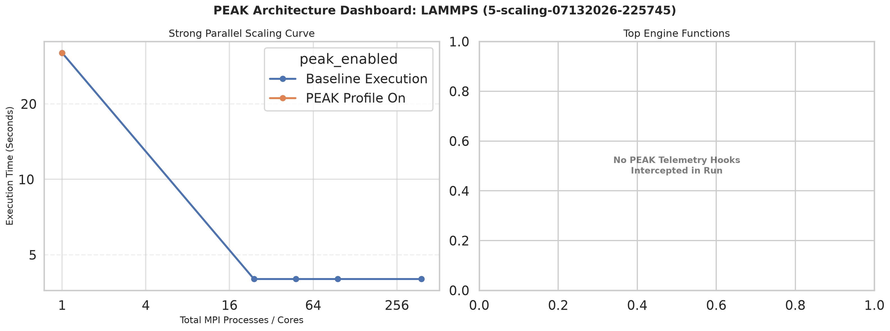

# Paper: An Analysis of Popular Scientific Programs for Impacts of HPC Scaling and Mathematical Library Usage Using PEAK

## Authors

- Caleb Wiyninger — Texas Advanced Computing Center
- Dr. Chun-Yaung Lu (Albert) — The University of Texas at Austin
- Dr. Yinzhi Wang (Ian) — Oklahoma City University

## Abstract

High Performance Computing (HPC) systems and the science, math, and machine learning programming libraries optimized for those systems are essential for accelerating large-scale scientific research. Maximizing the performance of these libraries is critical for enabling faster scientific discovery. Using the Performance Evaluation and Analysis Kit (PEAK) and usage data gathered from the Texas Advanced Computing Center (TACC), this project profiles several widely utilized science and math toolkits, including ABINIT, DFTB+, and GROMACS, to evaluate how efficiently they utilize standard numerical libraries such as BLAS, LAPACK, and FFTW across the diverse operational contexts common to HPC environments. By employing a cost-adaptive profiling strategy that balances accuracy and overhead trade-offs via dynamic library preloading, the expected outcome is to capture critical performance data points and library invocation frequencies that traditional profilers miss. At the conclusion of testing, the expectation is to identify specific computational bottlenecks and ideal operational conditions to deliver concrete optimization recommendations. This analysis will provide a definitive framework for the future design of high-performance computing infrastructure and tools prioritizing maximum runtime efficiency, ultimately reducing core-hour expenditure and accelerating computational workflows for the broader scientific community.

## Introduction

### Broad Context

- High Performance Computing (HPC) systems are critical research infrastructure that allow for the large levels of data processing required by modern science. They are built from many networked computers called nodes, each with dozens of CPU cores.
- Because of this architecture, scientific applications must be specifically designed to take advantage of the resources available across nodes and cores, or performance suffers.
- The Performance Evaluation and Analysis Kit (PEAK) is a tool that allows the user to analyze function calls, where compute time is spent, and how the targeted program utilizes popular mathematical libraries such as BLAS (Basic Linear Algebra Subprograms), LAPACK (Linear Algebra PACKage), and FFTW (Fastest Fourier Transform in the West).
- The goal of this study is to analyze popular scientific software used by researchers on the Frontera supercomputer for materials science, chemistry, and molecular simulation, and more, benchmarking its performance under different scaling conditions and its reliance on popular mathematical libraries via PEAK.

### Problem Statement

In order to optimize for HPC environments, many things must be known about a program:
- Dependencies: What other software and libraries the program depends on.
- Bottlenecks: Where a majority of compute time is spent.
- Scaling: How different levels and methods of scaling impact the program.
- Performance Impacts: What variables impact the program's performance in what way.

### Proposed Solution

- This study surveys a number of popular scientific software packages to get a birds eye view of general trends, testing the impact of different amounts and methods of scaling on each program as well as its reliance on popular mathematical libraries such as BLAS, LAPACK, and FFTW via PEAK.

### Roadmap

// just explain how to read this paper

## Background / Related Work

// put the obvious here

### PEAK Papers / Repo / Wiki

### BenchPro

## Methodology

### Overview

- Select: Programs selected from Frontera's most-used software list.
- Build: TACC modules and build scripts were used to keep binaries reproducible.
- Test: One representative test case / input chosen or created per program.
- Automate: Automated scripts generate scaling jobs, plus one PEAK-enabled job per program.
- Run: Jobs run on the Stampede3 HPC system on nodes equipped with Intel Xeon Platinum 8160 (“Skylake”) CPUs.
- Analyze: Timing and PEAK data collected for analysis.

### Frontera Top 100

- My mentors provided me a list of the top 100 program names by core hour for the Frontera HPC system as well as a list of programs of importance.
- Using these lists, a master list was made with unactionable program names such as "main" or "out", language interpreters such as python, or differing versions of the same program were filtered, resulting in 67 and counting actionable program names.

### Compute Environment

- Jobs were run on the Stampede3 HPC system, on nodes equipped with Intel Xeon Platinum 8160 ("Skylake") CPUs.
- Programs were selected from Frontera's most-used software list, but the actual scaling/PEAK runs for this phase of the study were executed on Stampede3.

### Build Scripts and Modules

- Many of the most used programs had modules available, but many required manual building in which we created custom build scripts which allowed for reproducible program binaries.

### Testing Suite Scripts

- For each run, two things are measured: total wall-clock time to completion, and, when PEAK is enabled, which specific library functions consume that time and how frequently they are invoked.
- In order to accelerate research, a script was made in order to take a program, test case, and unique constraints and automatically generate jobs for each level of scaling.
- The generated jobs also handled PEAK profiling, timing data, and general logging.

### Test Case

- Due to time constraints, the current phase of the study sticks to one test case (input file) per program, chosen or designed to represent a common or typical use case.

### Jobs

- Each job specifies the program, test case, and the resources (nodes, tasks) allocated to it, with resource allocation varied across jobs to test different scaling conditions.

### PEAK

- Each scaling study included a job which ran the base case with PEAK, gathering data on library usage and profiling overhead impact.

### Timing Summary

- At the conclusion of a job, data relating to the speed and success of a program was recorded and appended to a central timing table for easy scaling analysis.

### PEAK Results

- PEAK output allows us to get a better idea of what underlying dependencies are utilized and to what extent.

### Visualization

- A python script was used to take in gathered data and present it in intuitive and easy to understand form, allowing for quick interpretation and issue handling.

## Results

### Results Overview

| Program | Best Scaling | Dominant Function (by time) |
| --- | --- | --- |
| ABINIT | 384 Tasks (8 Nodes) | `zgemm_` |
| Quantum Expresso | 384 Tasks (8 Nodes) | `zgemm_` |
| LAMMPS | 24 Tasks (1 Node) | N/A |
| GROMACS | 768 Tasks (16 Nodes) | N/A |
| DFTB+ | 1 Task (1 Node) | `dsyev_` |

### ABINIT

*Simulates how electrons and atoms behave in materials, using quantum mechanics to predict a material's structure, energy, and properties.*

**Test Case:** Simulating a silicon crystal.

| Job Name | Config | Nodes | Tasks | PEAK? | Elapsed (s) | Exit Code | Job ID |
| --- | --- | --- | --- | --- | --- | --- | --- |
| `abinit_test_n1_nopeak` | `n1_nopeak` | 1 | 1 | No | **119** | 0 | 3294914 |
| `abinit_test_n24_nopeak` | `n24_nopeak` | 1 | 24 | No | **10** | 0 | 3294915 |
| `abinit_test_n48_nopeak` | `n48_nopeak` | 1 | 48 | No | **8** | 0 | 3294916 |
| `abinit_test_N2_nopeak` | `N2_nopeak` | 2 | 96 | No | **6** | 0 | 3294917 |
| `abinit_test_N8_nopeak` | `N8_nopeak` | 8 | 384 | No | **6** | 0 | 3294918 |
| `abinit_test_N16_nopeak` | `N16_nopeak` | 16 | 768 | No | **9** | 0 | 3294919 |
| `abinit_test_n1_peak` | `n1_peak` | 1 | 1 | Yes | **126** | 0 | 3294920 |

| Function | Calls | Total Time (s) | Avg Time / Call (ms) | PEAK Overhead (s) |
| --- | --- | --- | --- | --- |
| `zgemm_` | 207,990 | **4.7613** | 0.0229 | 0.4258 |
| `ddot_` | 216,544 | **0.6383** | 0.0029 | 0.4433 |
| `zcopy_` | 131,022 | **0.6081** | 0.0046 | 0.2682 |
| `dznrm2_` | 116,280 | **0.5958** | 0.0051 | 0.2380 |
| `zdotc_` | 51,588 | **0.1846** | 0.0036 | 0.1056 |

### Quantum Expresso

*Another quantum-mechanical materials simulation package, solving the same kind of problem as ABINIT with a different underlying computational method.*

**Test Case:** Simulating a silicon crystal.

| Job Name | Config | Nodes | Tasks | PEAK? | Elapsed (s) | Exit Code | Job ID |
| --- | --- | --- | --- | --- | --- | --- | --- |
| `qe_tc_n1_nopeak` | `n1_nopeak` | 1 | 1 | No | **636** | 0 | 3306688 |
| `qe_tc_n24_nopeak` | `n24_nopeak` | 1 | 24 | No | **63** | 0 | 3306689 |
| `qe_tc_n48_nopeak` | `n48_nopeak` | 1 | 48 | No | **34** | 0 | 3306690 |
| `qe_tc_N2_nopeak` | `N2_nopeak` | 2 | 96 | No | **28** | 0 | 3306691 |
| `qe_tc_N8_nopeak` | `N8_nopeak` | 8 | 384 | No | **20** | 0 | 3306692 |
| `qe_tc_N16_nopeak` | `N16_nopeak` | 16 | 768 | No | **27** | 0 | 3306693 |
| `qe_tc_n1_peak` | `n1_peak` | 1 | 1 | Yes | **638** | 0 | 3306694 |

| Function | Calls | Total Time (s) | Avg Time / Call (ms) | PEAK Overhead (s) |
| --- | --- | --- | --- | --- |
| `zgemm_` | 144,849 | **166.6082** | 1.1502 | 0.2227 |
| `zhegvx_` | 5,561 | **8.3896** | 1.5087 | 0.0085 |
| `zgemv_` | 1,184 | **3.7863** | 3.1979 | 0.0018 |
| `ddot_` | 57,984 | **0.3923** | 0.0068 | 0.0891 |
| `dcopy_` | 1,926 | **0.3207** | 0.1665 | 0.0030 |

### LAMMPS

*Simulates how large numbers of atoms and molecules move and interact over time (molecular dynamics), commonly used to study materials at the atomic scale.*

**Test Case:** Simulating protein in a membrane.

| Job Name | Config | Nodes | Tasks | PEAK? | Elapsed (s) | Exit Code | Job ID |
| --- | --- | --- | --- | --- | --- | --- | --- |
| `lammps_rhodo_n1_nopeak` | `n1_nopeak` | 1 | 1 | No | **32** | 0 | 3305579 |
| `lammps_rhodo_n24_nopeak` | `n24_nopeak` | 1 | 24 | No | **4** | 0 | 3305580 |
| `lammps_rhodo_n48_nopeak` | `n48_nopeak` | 1 | 48 | No | **4** | 0 | 3305581 |
| `lammps_rhodo_N2_nopeak` | `N2_nopeak` | 2 | 96 | No | **4** | 0 | 3305582 |
| `lammps_rhodo_N8_nopeak` | `N8_nopeak` | 8 | 384 | No | **4** | 0 | 3305583 |
| `lammps_rhodo_N16_nopeak` | `N16_nopeak` | 16 | 768 | No | **8** | 255 | 3305584 |
| `lammps_rhodo_n1_peak` | `n1_peak` | 1 | 1 | Yes | **32** | 0 | 3305585 |

> LAMMPS did not yield PEAK hits.

### GROMACS

*Simulates the motion and interactions of biomolecules like proteins and lipids, widely used to study biological and chemical processes.*

**Test Case:** Simulating protein in a cell membrane.

| Job Name | Config | Nodes | Tasks | PEAK? | Elapsed (s) | Exit Code | Job ID |
| --- | --- | --- | --- | --- | --- | --- | --- |
| `gromacs_benchMEM_n24_nopeak` | `n24_nopeak` | 1 | 24 | No | **213** | 0 | 3295859 |
| `gromacs_benchMEM_n48_nopeak` | `n48_nopeak` | 1 | 48 | No | **125** | 0 | 3295860 |
| `gromacs_benchMEM_n48_peak` | `n48_peak` | 1 | 48 | Yes | **126** | 0 | 3295864 |
| `gromacs_benchMEM_N2_nopeak` | `N2_nopeak` | 2 | 96 | No | **75** | 0 | 3295861 |
| `gromacs_benchMEM_N8_nopeak` | `N8_nopeak` | 8 | 384 | No | **37** | 0 | 3295862 |
| `gromacs_benchMEM_N16_nopeak` | `N16_nopeak` | 16 | 768 | No | **36** | 0 | 3295863 |

> GROMACS did not yield PEAK hits.

### DFTB+

*A faster, approximate alternative to full quantum-mechanical simulation, trading some accuracy for greatly reduced compute time.*

**Test Case:** Simulating a carbon molecule.

| Job Name | Config | Nodes | Tasks | PEAK? | Elapsed (s) | Exit Code | Job ID |
| --- | --- | --- | --- | --- | --- | --- | --- |
| `dftb_spinlock_n1_nopeak` | `n1_nopeak` | 1 | 1 | No | **120** | 0 | 3303873 |
| `dftb_spinlock_n24_nopeak` | `n24_nopeak` | 1 | 24 | No | **144** | 0 | 3303874 |
| `dftb_spinlock_n48_nopeak` | `n48_nopeak` | 1 | 48 | No | **220** | 0 | 3303875 |
| `dftb_spinlock_n1_peak` | `n1_peak` | 1 | 1 | Yes | **121** | 0 | 3303879 |
| `dftb_spinlock_N2_nopeak` | `N2_nopeak` | 2 | 96 | No | **2** | 1 | 3303876 |
| `dftb_spinlock_N8_nopeak` | `N8_nopeak` | 8 | 384 | No | **3** | 1 | 3303877 |
| `dftb_spinlock_N16_nopeak` | `N16_nopeak` | 16 | 768 | No | **3** | 1 | 3303878 |

| Function | Calls | Total Time (s) | Avg Time / Call (s) | PEAK Overhead (s) |
| --- | --- | --- | --- | --- |
| `dsyev_` | 4 | **94.1030** | 23.5258 | 0.0000 |
| `dgemm_` | 442 | **10.5098** | 0.0238 | 0.0007 |
| `dsymm_` | 4 | **10.0370** | 2.5092 | 0.0000 |
| `dlarrv_` | 4 | **0.1037** | 0.0259 | 0.0000 |
| `dcopy_` | 34,760 | **0.0280** | 0.0008 | 0.0541 |

## Discussion / Analysis

- Overall, these results demonstrate that increasing core counts does not guarantee linear speedup and can lead to resource waste if software limits are unaddressed.

### ABINIT

- ABINIT scaled effectively from 1 to 384 tasks (119s → 6s), but performance degrades slightly at 768 tasks (9s), most likely due to inter-node communication overhead.
- As more resources are allocated, speedup drops off, and at the high end of scaling it even becomes less efficient.

### Quantum Expresso

- Similar story to ABINIT: QE scales well up to 384 tasks (636s → 20s), then degrades at 768 tasks (27s).

### LAMMPS

- LAMMPS plateaus fast (32s → 4s by 24 tasks) and stays flat through 384 tasks, before failing (exit code 255) at 768 tasks.
- The program or test case seems to impose a hard limit on what resources LAMMPS allows itself to attempt to use.
- Did not produce PEAK hits.

### GROMACS

- GROMACS scaled the best out of the group, successfully taking advantage of all the resources it was given.
- Did not produce PEAK hits.

### DFTB+

- DFTB+ performed worse with more resources on a single node (120s → 144s → 220s) and outright crashed (exit code 1) when multiple nodes were introduced.
- Root cause is not yet understood and needs further diagnosis (see Future Work).

## Conclusion

These results demonstrate that increasing core counts does not guarantee linear speedup and can lead to resource waste if software limits are unaddressed.
Figure 2 - ABINIT scaled effectively from 1 → 384 tasks (119s → 6s), but got slightly worse at 768 tasks (9s). This is most likely due to inter-node communication overhead.
Figure 3 - Quantum Espresso is a similar story: scales well up to 384 tasks (636s → 20s), then degrades at 768 tasks (27s).
Figure 4 - DFTB+ performed worse with more resources and outright crashed when multiple nodes were introduced.
Figure 5 - GROMACS scaled the best out of the group, successfully taking advantage of all the resources we gave it. GROMACS did not yield PEAK hits.
Figure 6 - LAMMPS plateaus fast (32s → 4s by 24 tasks) and stays flat through 384 tasks. The program or test case seems to impose a hard limit on what resources the program allows itself to attempt to use. LAMMPS did not yield PEAK hits.
To cover a broad survey of Frontera's most-used programs, a breadth-first approach was taken over deep per-program investigation, leaving room to resolve profiling issues and test more permutations for deeper insight.
For the programs that yielded no PEAK results, it is likely due to how they were compiled. Rebuilding the programs under different configurations may yield PEAK results.

## Limitations

- This study was very limited on time, so a breadth-first approach was taken. With more time, profiling issues can be solved and more permutations can be tested, giving us deeper insights.
- For the programs that yielded no PEAK results (LAMMPS, GROMACS), it is likely due to how they were compiled. Rebuilding the programs under different configurations may yield PEAK results.

## Future Work

- Diagnose why LAMMPS/GROMACS show no BLAS/LAPACK/FFTW PEAK hits.
- Diagnose the causes of DFTB+'s scaling and crash behavior.
- Add more test cases per program.
- Continue to build out a list of actionable programs.
- Continue to profile programs on our list.

## Acknowledgments

- TACC
- National Science Foundation (NSF) — Award ID's: 2447887 and OAC-2402542
- Frontera
- Stampede3
- UT
- OCU
- Rosalia Gomez — Education and Outreach Directorate at TACC
- Dr. Chun-Yaung Lu (Albert) — Research Associate at TACC and Mentor
- Dr. Yinzhi Wang (Ian) — Research Associate at TACC and Mentor
- Bobby Reed — Professor at OCU
- Dr. Xu Shine — Professor at OCU

---

## Notes

- Amdahl's Law
- 4 - 8 pages for paper
