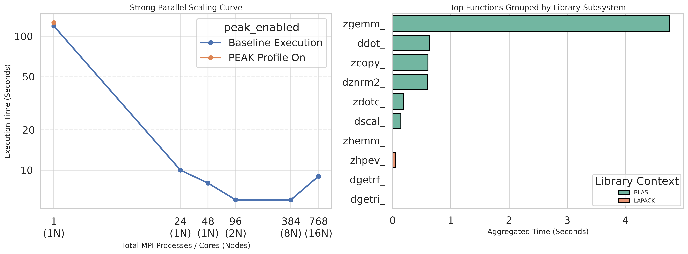
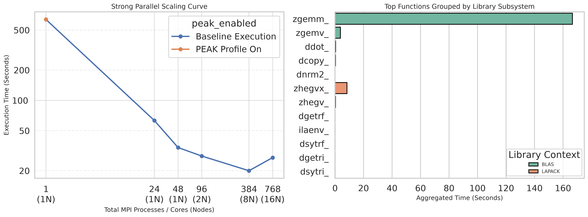
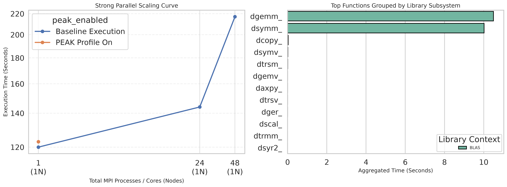
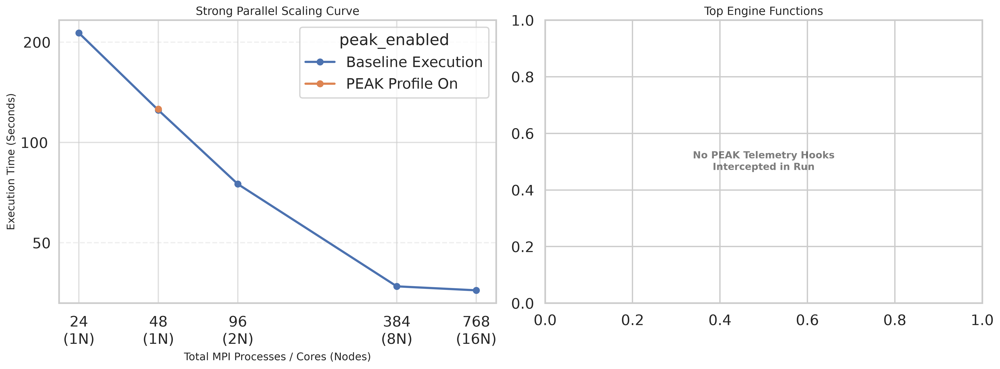
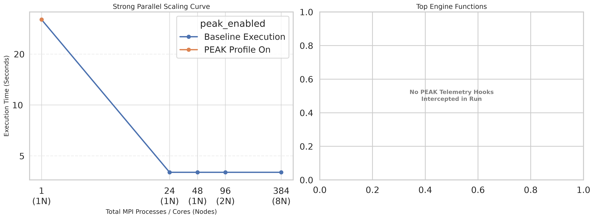

# Paper: Measuring HPC Efficiency with PEAK: How Well Do Your Tools Use Supercomputer Resources?

## Intro

## Abstract

High Performance Computing (HPC) systems and the science, math, and machine learning programming libraries optimized for those systems are essential for accelerating large-scale scientific research.
Maximizing the performance of these libraries is critical for enabling faster scientific discovery.
Using the Performance Evaluation and Analysis Kit (PEAK) and usage data gathered from the Texas Advanced Computing Center (TACC), this project profiles several widely utilized science and math toolkits, including ABINIT, DFTB+, and GROMACS, to evaluate how efficiently they utilize standard numerical libraries such as BLAS, LAPACK, and FFTW across the diverse operational contexts common to HPC environments.
By employing a cost-adaptive profiling strategy that balances accuracy and overhead trade-offs via dynamic library preloading, the expected outcome is to capture critical performance data points and library invocation frequencies that traditional profilers miss.
At the conclusion of testing, the expectation is to identify specific computational bottlenecks and ideal operational conditions to deliver concrete optimization recommendations.
This analysis will provide a definitive framework for the future design of high-performance computing infrastructure and tools prioritizing maximum runtime efficiency, ultimately reducing core-hour expenditure and accelerating computational workflows for the broader scientific community.

### Broad Context

High Performace Computing (HPC) systems are critical tools for accelerating large scale scientific research.
These systems are built from many interconnected computers referred to as nodes.
Due to this unique architecture, programs must be designed specifically to take advantage of these resources.

### The Problem

In order to optimize for these environments, many things must be know about a program: What other software it relies on, where a majority of computation time is spent, how different amounts and types of resources affects performance, and the impact of different variables on performance.

### The Solution

Using usage data from the Texas Advanced Computing Center (TACC), the Performace Evaluation and Analysis Kit (PEAK), and the Stampede3 supercomputer, we can analyze some of the most used scientific software to determine how well they utilize HPC resources and get a deeper insight into where the programs are spending their time.

### Roadmap

This paper will provide an overview of how modern HPC systems work, what problems they introduce for optimization, where these programs spend their time, what libraries these programs rely on, and how well these programs take advantage of HPC resources.
Section 2 will provide a brief overview of HPC systems and the challenges they introduce as well as an introduction to the PEAK tool.
Section 3 will provide an overview of the methodology of how we select, build, test, scale, and analyze the programs.
Section 4 will present our results.
Section 5 will provide a discussion of our results and what they mean for the programs we analyzed.
Section 6 will highlight some of our limitations and explain how we plan to address them among other future work.
Section 7 will provide a conclusion and summary of our findings.

## Background

### HPC Systems

Most modern HPC systems are built upon a cluster computing architecture, this means that they are made up of many interconnected computers referred to as nodes.
These nodes vary in hardware, purpose, and performance but all are meant to work together to solve large scale problems.
In order to run a program on an HPC system, a scheduler is used to allocate resources and manage the execution of the program.
A user must submit a job script to the scheduler that specifies the resources needed and the program to be run and the scheduler will then allocate the resources and run the program on the allocated nodes.

### PEAK

PEAK is a tool designed for HPC systems that allows the user to analyze a target program for function calls, where compute time is spent, and how the targeted program utilizes popular mathematical libraries such as BLAS (Basic Linear Algebra Subprograms), LAPACK (Linear Algebra PACKage), and FFTW (Fastest Fourier Transform in the West).
PEAK uses the Frida-Gum toolkit to inject monitering code into running binaries and dynamically attaches and deattaches to stay below a specified level of overhead.
This allows for PEAK to provide more accurate results while still keeping overhead low.
PEAK is configured via enviromental variables and invoked via LD_PRELOAD.

## Methodology

A list of the 100 program names, sorted by core hour used, gathered from the Frontera supercomputer was trimmed of unactionable names such as duplicates, language interpreters, or generic names into a list of actionable names.
We added more programs to this list based on our own knowledge of popular scientific software.
Cursory research was done on each program in order to determine domain, purpose, and if TACC had a prebuilt version of the program available.
LLM's were used to assist in this research.
There are currently 67 programs and counting in this list.

### Enviroment

All programs were run on the Stampede3 supercomputer at TACC using nodes equipped with 48 core Intel Xeon Platinum 8160 ("Skylake") processors and 192 GB of RAM.

### Build Scripts and Modules

Some programs were available as prebuilt modules maintained by TACC, while others required building from source.
In order to keep binaries reproducible and identical, we opted for TACC's modules when available and created build scripts when they were not.

### Test Cases / Input

For each program, we chose or created a test case that would run in a reasonable amount of time and represent a typical use case for the program.
When available, we sourced our test cases from a program's pre-bundled test cases or third party test cases.
When those sources were unavailable, we created our own test cases.
Due to the in depth knowledge required to create or modify a test case for a program, LLM's were used to assist in creating and modifying test cases.

### Scaling

Program were run at a series of different scales, starting with a single node and scaling up to 16 nodes.
Single node scaling was done at 1, 24, and 48 cores.
Multi-node scaling was done at 2, 8, and 16 nodes with 48 cores per node.

### Automation Scripts

In order to speed up research, a reusable bash script was created to automatically generate the needed job scripts for each program, scale, and test case.
The script read from a configuration file that specified the program, scale, and test cases to be run.
Another job was created to run the target program with PEAK attached and configured to profile for BLAS, LAPACK, and FFTW function calls.
Another script was created to consalidate similar jobs into job arrays to reduce the number of jobs submitted to the scheduler, allowing for more jobs to be submitted at once.
All jobs were orgranized into directories based on program name, scale, and test case for easy access and analysis.
All jobs included timing logging and automatically appended data to a main summary file.

### Visualization

In order to understand our results, we created a python script to parse the summary files and generate visualizations of the data.

## Results

### ABINIT

#### Description

Simulates how electrons and atoms behave in materials, using quantum mechanics to predict a material's structure, energy, and properties.

#### Test Case

Simulating a silicon crystal

#### Summary

| Job Name | Config | Nodes | Tasks | PEAK? | Elapsed (s) | Exit Code | Job ID |
| --- | --- | --- | --- | --- | --- | --- | --- |
| `abinit_test_n1_nopeak` | `n1_nopeak` | 1 | 1 | No | **119** | 0 | 3294914 |
| `abinit_test_n24_nopeak` | `n24_nopeak` | 1 | 24 | No | **10** | 0 | 3294915 |
| `abinit_test_n48_nopeak` | `n48_nopeak` | 1 | 48 | No | **8** | 0 | 3294916 |
| `abinit_test_N2_nopeak` | `N2_nopeak` | 2 | 96 | No | **6** | 0 | 3294917 |
| `abinit_test_N8_nopeak` | `N8_nopeak` | 8 | 384 | No | **6** | 0 | 3294918 |
| `abinit_test_N16_nopeak` | `N16_nopeak` | 16 | 768 | No | **9** | 0 | 3294919 |
| `abinit_test_n1_peak` | `n1_peak` | 1 | 1 | Yes | **126** | 0 | 3294920 |

#### PEAK Results

| Function | Calls | Total Time (s) | Avg Time / Call (ms) | PEAK Overhead (s) |
| --- | --- | --- | --- | --- |
| `zgemm_` | 207,990 | **4.7613** | 0.0229 | 0.4258 |
| `ddot_` | 216,544 | **0.6383** | 0.0029 | 0.4433 |
| `zcopy_` | 131,022 | **0.6081** | 0.0046 | 0.2682 |
| `dznrm2_` | 116,280 | **0.5958** | 0.0051 | 0.2380 |
| `zdotc_` | 51,588 | **0.1846** | 0.0036 | 0.1056 |

#### Figure 1 - ABINIT Results

### Quantum Espresso

#### Description

Quantum-mechanical materials simulation package, solving the same kind of problem as ABINIT with a different underlying computational method.

#### Test Case

Simulating a silicon crystal

#### Summary

| Job Name | Config | Nodes | Tasks | PEAK? | Elapsed (s) | Exit Code | Job ID |
| --- | --- | --- | --- | --- | --- | --- | --- |
| `qe_tc_n1_nopeak` | `n1_nopeak` | 1 | 1 | No | **636** | 0 | 3306688 |
| `qe_tc_n24_nopeak` | `n24_nopeak` | 1 | 24 | No | **63** | 0 | 3306689 |
| `qe_tc_n48_nopeak` | `n48_nopeak` | 1 | 48 | No | **34** | 0 | 3306690 |
| `qe_tc_N2_nopeak` | `N2_nopeak` | 2 | 96 | No | **28** | 0 | 3306691 |
| `qe_tc_N8_nopeak` | `N8_nopeak` | 8 | 384 | No | **20** | 0 | 3306692 |
| `qe_tc_N16_nopeak` | `N16_nopeak` | 16 | 768 | No | **27** | 0 | 3306693 |
| `qe_tc_n1_peak` | `n1_peak` | 1 | 1 | Yes | **638** | 0 | 3306694 |

#### PEAK Results

| Function | Calls | Total Time (s) | Avg Time / Call (ms) | PEAK Overhead (s) |
| --- | --- | --- | --- | --- |
| `zgemm_` | 144,849 | **166.6082** | 1.1502 | 0.2227 |
| `zhegvx_` | 5,561 | **8.3896** | 1.5087 | 0.0085 |
| `zgemv_` | 1,184 | **3.7863** | 3.1979 | 0.0018 |
| `ddot_` | 57,984 | **0.3923** | 0.0068 | 0.0891 |
| `dcopy_` | 1,926 | **0.3207** | 0.1665 | 0.0030 |

#### Figure 2 - Quantum Espresso Results

### DFTB+

#### Description

A faster, approximate alternative to full quantum-mechanical simulation, trading some accuracy for greatly reduced compute time.

#### Test Case

Simulating a carbon molecule

#### Summary

| Job Name | Config | Nodes | Tasks | PEAK? | Elapsed (s) | Exit Code | Job ID |
| --- | --- | --- | --- | --- | --- | --- | --- |
| `dftb_spinlock_n1_nopeak` | `n1_nopeak` | 1 | 1 | No | **120** | 0 | 3303873 |
| `dftb_spinlock_n24_nopeak` | `n24_nopeak` | 1 | 24 | No | **144** | 0 | 3303874 |
| `dftb_spinlock_n48_nopeak` | `n48_nopeak` | 1 | 48 | No | **220** | 0 | 3303875 |
| `dftb_spinlock_n1_peak` | `n1_peak` | 1 | 1 | Yes | **121** | 0 | 3303879 |
| `dftb_spinlock_N2_nopeak` | `N2_nopeak` | 2 | 96 | No | **2** | 1 | 3303876 |
| `dftb_spinlock_N8_nopeak` | `N8_nopeak` | 8 | 384 | No | **3** | 1 | 3303877 |
| `dftb_spinlock_N16_nopeak` | `N16_nopeak` | 16 | 768 | No | **3** | 1 | 3303878 |

#### PEAK Results

| Function | Calls | Total Time (s) | Avg Time / Call (s) | PEAK Overhead (s) |
| --- | --- | --- | --- | --- |
| `dsyev_` | 4 | **94.1030** | 23.5258 | 0.0000 |
| `dgemm_` | 442 | **10.5098** | 0.0238 | 0.0007 |
| `dsymm_` | 4 | **10.0370** | 2.5092 | 0.0000 |
| `dlarrv_` | 4 | **0.1037** | 0.0259 | 0.0000 |
| `dcopy_` | 34,760 | **0.0280** | 0.0008 | 0.0541 |

#### Figure 3 - DFTB+ Results

### GROMACS

#### Description

Simulates the motion and interactions of biomolecules like proteins and lipids, widely used to study biological and chemical processes.

#### Test Case

Simulating protein in a membrane.

#### Summary

| Job Name | Config | Nodes | Tasks | PEAK? | Elapsed (s) | Exit Code | Job ID |
| --- | --- | --- | --- | --- | --- | --- | --- |
| `gromacs_benchMEM_n24_nopeak` | `n24_nopeak` | 1 | 24 | No | **213** | 0 | 3295859 |
| `gromacs_benchMEM_n48_nopeak` | `n48_nopeak` | 1 | 48 | No | **125** | 0 | 3295860 |
| `gromacs_benchMEM_n48_peak` | `n48_peak` | 1 | 48 | Yes | **126** | 0 | 3295864 |
| `gromacs_benchMEM_N2_nopeak` | `N2_nopeak` | 2 | 96 | No | **75** | 0 | 3295861 |
| `gromacs_benchMEM_N8_nopeak` | `N8_nopeak` | 8 | 384 | No | **37** | 0 | 3295862 |
| `gromacs_benchMEM_N16_nopeak` | `N16_nopeak` | 16 | 768 | No | **36** | 0 | 3295863 |

#### PEAK Results

This build of GROMACS did not yield any PEAK hits.

#### Figure 4 - GROMACS Results

### LAMMPS

#### Description

Simulates how large numbers of atoms and molecules move and interact over time (molecular dynamics), commonly used to study materials at the atomic scale.

#### Test Case

Simulating protein in a membrane.

#### Summary

| Job Name | Config | Nodes | Tasks | PEAK? | Elapsed (s) | Exit Code | Job ID |
| --- | --- | --- | --- | --- | --- | --- | --- |
| `lammps_rhodo_n1_nopeak` | `n1_nopeak` | 1 | 1 | No | **32** | 0 | 3305579 |
| `lammps_rhodo_n24_nopeak` | `n24_nopeak` | 1 | 24 | No | **4** | 0 | 3305580 |
| `lammps_rhodo_n48_nopeak` | `n48_nopeak` | 1 | 48 | No | **4** | 0 | 3305581 |
| `lammps_rhodo_N2_nopeak` | `N2_nopeak` | 2 | 96 | No | **4** | 0 | 3305582 |
| `lammps_rhodo_N8_nopeak` | `N8_nopeak` | 8 | 384 | No | **4** | 0 | 3305583 |
| `lammps_rhodo_N16_nopeak` | `N16_nopeak` | 16 | 768 | No | **8** | 255 | 3305584 |
| `lammps_rhodo_n1_peak` | `n1_peak` | 1 | 1 | Yes | **32** | 0 | 3305585 |

#### PEAK Results

This build of LAMMPS did not yield any PEAK hits.

#### Figure 5 - LAMMPS Results

## Discussion

### ABINIT

ABINIT scaled effectively from 1 → 384 tasks (119s → 6s), but got slightly worse at 768 tasks (9s). This is most likely due to inter-node communication overhead.
This is a common problem in HPC systems, where the time spent communicating between nodes can outweigh the benefits of adding more resources.
This run represents what we would expect from most programs, where more resources leads to better performance, but only up to a certain point.
ABINIT relies heavily on BLAS and somewhat in LAPACK.
A majority of compute is spent on the `zgemm_` function, which is a BLAS function for matrix multiplication.

### Quantum Espresso

Quantum Espresss scales well up to 384 tasks (636s → 20s), then degrades at 768 tasks (27s).
This is a similar story to ABINIT, where the program scales well up to a certain point, but then suffers from inter-node communication overhead.
Quantum Espresso's PEAK results resemble ABINIT's, with a majority of compute time spent on the `zgemm_` function, which is a BLAS function for matrix multiplication.

### DFTB+

The most interesting result from our study was DFTB+, which performed worse with more resources and outright crashed when multiple nodes were introduced.
This is a clear example of a program that does not scale well and is not designed to take advantage of HPC resources.
These results tell us that DFTB+ or its test case is not designed to take advantage of multiple nodes and is not suitable for running on an HPC system.
DFTB+ relies on BLAS, with a majority of compute time spent on `dsymm_` and `zgemm_`, `dsymm_` being another BLAS function for matrix multiplication.

### GROMACS

GROMACS scaled the best out of the group, successfully taking advantage of all the resources we gave it.
GROMACS did not yield PEAK hits, which is likely due to how it was compiled. Rebuilding GROMACS under different configurations may yield PEAK results.
GROMACS is an example of what we would expect from a well optimized HPC program, where more resources leads to better performance.

### LAMMPS

LAMMPS plateaus fast (32s → 4s by 24 tasks) and stays flat through 384 tasks. The program or test case seems to impose a hard limit on what resources the program allows itself to attempt to use.
This is an example of a program or test case that does avoids situations where inter-node communication overhead can become a problem by not allowing itself to use more resources than it can effectively utilize.
LAMMPS did not yield PEAK hits, which is likely due to how it was compiled. Rebuilding LAMMPS under different configurations may yield PEAK results.

### General Discussion

To cover a broad survey of Frontera's most-used programs, a breadth-first approach was taken over deep per-program investigation, leaving room to resolve profiling issues and test more permutations for deeper insight.
For the programs that yielded no PEAK results, it is likely due to how they were compiled. Rebuilding the programs under different configurations may yield PEAK results.

## Limitations and Future Work

The main limitation of this study is the breadth-first approach taken, which left room for deeper investigation into each program.
Future work will include rebuilding programs under different configurations to yield PEAK results, testing more permutations of test cases and scales, and investigating the programs that did not scale well to determine if it is a problem with the program itself or the test case used.
It is planned to expand this study from an REU (Research Experience for Undergraduates) project to a full research project, with the goal of publishing the results in a peer-reviewed journal.
With more time, and using the knowledge gained from this study, we can investigate more programs and test more permutations to get a deeper insight into how well these programs utilize HPC resources.

## Conclusion

This study showcases the need for deeper understanding of how software runs on HPC sytems ans the need for a deeper understanding.
Many researchers intuitively expect that more resources means a faster turnaround from their programs, from our results we can see this is not always true.

## Acknowledments

This research and experience would not have been possible without the funding, resources, and support provided by:

Texas Advanced Computing Center (TACC)
National Science Foundation (NSF)
    REU Award ID: 2447887
    PEAK Project Award ID OAC-2402542
Frontera Supercomputer
Stampede3 Supercomputer
University of Texas at Austin (UT)
Oklahoma City University (OCU)
Rosalia Gomez - Education and Outreach Directorate at TACC and REU Program Coordinator
Dr. Chun-Yaung Lu (Albert) - Research Associate at TACC and Mentor
Dr. Yinzhi Wang (Ian) - Research Associate at TACC and Mentor
Bobby Reed - Professor at OCU
Dr. Chenguang Xu (Shine) - Professor at OCU

## References

PEAK Repository: peak team. 2024. PEAK: Lightweight, versatile performance evaluation tool. https://github.com/peak-team/peak.

PEAK: Cost-Adaptive Profiling in a Heartbeat: Yuheng Chen, Junjie Li, Chun-Yaung Lu, and Yinzhi Wang. 2025. PEAK: Cost-Adaptive Profiling in a Heartbeat. In Workshops of the International Conference for High Performance Computing, Networking, Storage and Analysis (SC Workshops 25). https://doi.org/10.1145/3731599.3767521.

PEAK: a Light-Weight Profiler for HPC Systems: Yinzhi Wang and Junjie Li. 2023. PEAK: a Light-Weight Profiler for HPC Systems. In Workshops of The International Conference on High Performance Computing, Network, Storage, and Analysis (SC-W 2023). https://doi.org/10.1145/3624062.3624143.

Frontera System: Dan Stanzione, John West, R. Todd Evans, Tommy Minyard, Omar Ghattas, and Dhabaleswar K. Panda. 2020. Frontera: The Evolution of Leadership Computing at the National Science Foundation. In Practice and Experience in Advanced Research Computing 2020: Catch the Wave. https://doi.org/10.1145/3311790.3396656.

Stampede3 System: Texas Advanced Computing Center (TACC). 2024. Stampede3 User Guide. Retrieved from https://docs.tacc.utexas.edu/hpc/stampede3/. Funded by the National Science Foundation under Award No. 2320757.

ABINIT: Romero, A. H., et al. (2020). ABINIT: Overview and focus on selected capabilities. The Journal of Chemical Physics, 152(12), 124102. https://doi.org/10.1063/1.5144261

Quantum ESPRESSO: Giannozzi, P., et al. (2009). QUANTUM ESPRESSO: a modular and open-source software project for quantum simulations of materials. Journal of Physics: Condensed Matter, 21(39), 395502. https://doi.org/10.1088/0953-8984/21/39/395502

GROMACS: Abraham, M. J., et al. (2015). GROMACS: High performance molecular simulations through multi-level parallelism from laptops to supercomputers. SoftwareX, 1-2, 19-25. https://doi.org/10.1016/j.softx.2015.06.001

LAMMPS: Thompson, A. P., et al. (2022). LAMMPS - a flexible simulation tool for particle-based materials modeling at the atomic, meso, and continuum scales. Computer Physics Communications, 271, 108171. https://doi.org/10.1016/j.cpc.2021.108171

DFTB+: Hourahine, B., et al. (2020). DFTB+, a software package for efficient approximate density functional theory based atomistic simulations. The Journal of Chemical Physics, 152(12), 124101. https://doi.org/10.1063/1.5143190
