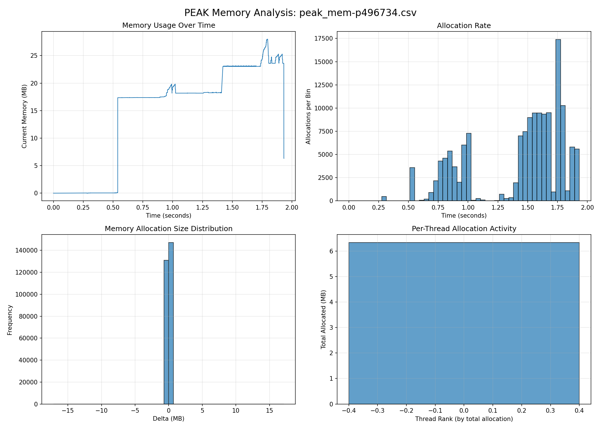
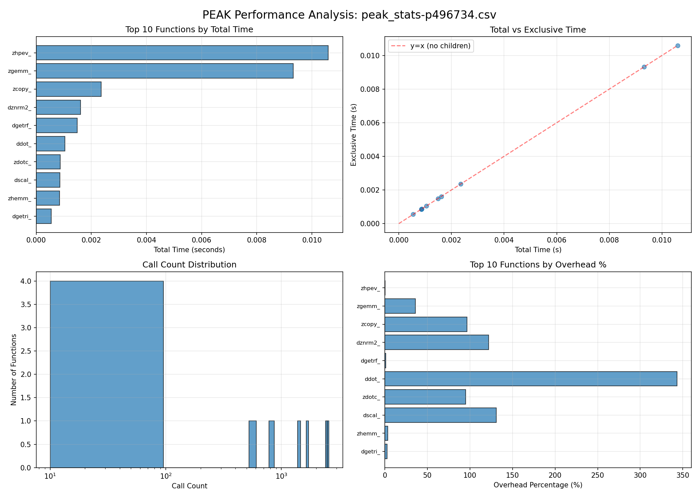

# Weekly Report

## TODO:

- write research plan

## What I worked on this week

### built all programs in the project dir

### Created a script to run and profile ABINIT

I created a to run and profile ABINIT, meant to be the blueprint for the other
programs

#### ABINIT profile

I ran ABINIT on its 0th test case on 2 nodes with 16 MPI tasks. I set PEAK to
profile memory, BLAS, LAPACK, and FFTW.





[Library usage report](./abinit/test/peak_stats-p496734_library_report.txt)

``` python ../../peak_analysis_v2.py peak_stats-p496734.csv --mem peak_mem-p496734.csv
Loading memory log from: peak_mem-p496734.csv
Memory graphs saved to: peak_mem-p496734_graphs.png

=== Memory Log Summary ===
Total events: 277895
Peak memory: 27.99 MB
Total allocated: 113.99 MB
Total freed: 107.66 MB
Unique threads: 1
Duration: 1.93 seconds

Loading stats log from: peak_stats-p496734.csv
Stats graphs saved to: peak_stats-p496734_graphs.png
Library usage report saved to: peak_stats-p496734_library_report.txt

=== Stats Log Summary ===
Total functions profiled: 10
Total profiled time: 0.03 seconds
Total exclusive time: 0.03 seconds
Total overhead: 0.0132 seconds
Total calls: 9500

=== Top 10 Functions by Total Time ===
function  total_s  exclusive_s  count
  zhpev_ 0.010592     0.010592     26
  zgemm_ 0.009319     0.009319   2410
  zcopy_ 0.002355     0.002355   1634
 dznrm2_ 0.001615     0.001615   1414
 dgetrf_ 0.001491     0.001491     10
   ddot_ 0.001044     0.001044   2574
  zdotc_ 0.000873     0.000873    596
  dscal_ 0.000856     0.000856    804
  zhemm_ 0.000854     0.000854     22
 dgetri_ 0.000548     0.000548     10

=== Library Usage Summary ===
Library         Calls        % Calls    Time (s)
-------------------------------------------------------
BLAS            9454         99.89      0.0169
LAPACK          10           0.11       0.0015

=== BLAS Breakdown ===
  L1-Vector            7022         74.28%
  L3-Matrix-Matrix     2432         25.72%
```

ABINIT's 0th test seems to very heavily on BLAS for matrix and vector operations,
specifically ddot for vector dot products and zgemm for matrix multiplication

### Created a python script to do basic analysis profiling outputs

I created a python script to visualize the outputs of PEAK. It graphs both stat
and mem csv's as well data about target group libraries.

### Sorted the top 100 list for actionable and unique items

Removed generic names, interpretors, and consolidated names.
Also had claude write up a blurb for eacg item so I have a better idea of the
programs use and operations.

## What I learned this week

- building on HPC systems
- how to run PEAK on HPC systems and profile for BLAS, LAPACK, and FFTW
- Im a bit more familiar with the top 100 items now

## Questions / Issues
