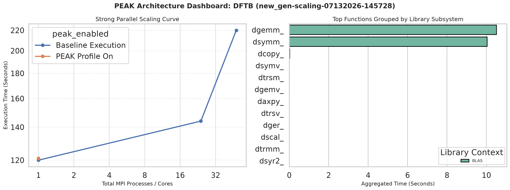

``` LM's_Feedback(Addressed)
notes
as someone who kinda understand your research please explain the following in your poster or research because this is very TACC heavy things that I don't think some people will understand if they dont know how HPC works

like the first title better Measuring HPC Efficiency with PEAK: How Well Do Your Tools Use HPC Resources?

- I got lost with the abbreviations for BLAS, LAPACK, and FFTW. Consider telling us what it stands for.
- I know what scaling means but explain to your audience what you mean by scaling.
- for methodology what are we testing for exactly? how long it takes to compute? or what slows down computation?
- what do you mean by a job
- what is a node?
```

``` Sonnie's_Feedback

```

``` William's_Feedback(Somewhat_Adressed)
first bullet point not needed unless you can expand on it that differs from the second
> "Research Objectives"

What test cases? (Bullet point 3)

like you can write something like  "In various cases we implement X to see Y, and how Y works", Sometime Y is not achieveable so you can write "Instead it gave us Z"
```

# Poster:

## Header

### Title

#### Possible Titles

- Measuring HPC Efficiency with PEAK: How Well Do Your Tools Use HPC Resources?
- Profiling Scaling and Library Usage in Popular HPC Applications with PEAK

### Acknowledgments

- TACC
- NSF // include award number
- Frontera
- Stampede3
- UT
- OCU

## Section 1
// Intro

### Background Information

- High Performance Computing (HPC) systems are critical research infrastructure that allows for the large levels of data processing required by modern science.
- Due to the unique architecture of HPC systems, it is imperative for scientific applications to be specifically built such that they take full advantage of the computational resources available on an HPC system. HPC systems are built from many networked computers called nodes, each with dozens of CPU cores, so a program's performance depends heavily on how well it uses cores within and across nodes.
- The Performance Evaluation Analysis Kit (PEAK) is a tool that allows the user to analyze function calls, where compute time is spent, and how the targeted program utilizes popular mathematical libraries such as BLAS (Basic Linear Algebra Subprograms), LAPACK (Linear Algebra PACKage), and FFTW (Fastest Fourier Transform in the West).
- The goal of this study is to analyze popular scientific software and benchmark their performance under different scaling conditions (running the same program with progressively more CPU cores and nodes to see how its speed changes), as well as see how the program relies on popular mathematical libraries via PEAK.

### Problem Statement

- In order to optimize better for HPC environments, many things must be known about a program:
    - What other software and libraries the program depends on.
    - Where a majority of compute time is spent.
    - How different levels and methods of scaling impact the program.
    - What variables impact the programs performance in what way.

### Research Objectives

- This study surveys a number of popular scientific software packages to get a birds eye view of general trends, testing the impact of different amounts and methods of scaling on each program as well as its reliance on popular mathematical libraries such as BLAS, LAPACK, and FFTW via PEAK.

### Methodology

- For each run, we measure two things: how long the program takes to finish in real time seconds, when PEAK is enabled, which specific math library functions consume that time and how often they are called.
- Using a list of the most used programs on the Frontera supercomputer, we chose programs of interest to analyze.
- For each program chosen, a corresponding test case / input file was also chosen. These were chosen or designed to be represent a common or typical use case.
- An automated profiling suite would generate a series of jobs (A script that specifies what program to run and what resources and conditons to run it with) that would run the program under different scaling conditions.
- An extra job would be generated to run the program under PEAK.
- All jobs were run on the Stampede3 HPC system.
- After all jobs were completed, timing data and the PEAK results would be collected and analyzed.

## Section 2
// Main content, graphs, etc.
// ensure plots DPI >= 150

### Results Overview

| Program | Best Scaling | Dominant Function (by time) |
| --- | --- | --- |
| ABINIT | 384 Tasks (8 Nodes) | `zgemm_` |
| Quantum Expresso | 384 Tasks (8 Nodes) | `zgemm_` |
| LAMMPS | 24 Tasks (1 Node) | N/A |
| GROMACS | 768 Tasks (16 Nodes) | N/A |
| DFTB+ | 1 Task (1 Node) | `dsyev_` |

### ABINIT

*Simulates how electrons and atoms behave in materials, using quantum mechanics to predict a material's structure, energy, and properties.*


### QE // candidate for cutting if not enough space

*Another quantum-mechanical materials simulation package, solving the same kind of problem as ABINIT with a different underlying computational method.*


### LAMMPS // candidate for cutting if not enough space

*Simulates how large numbers of atoms and molecules move and interact over time (molecular dynamics), commonly used to study materials at the atomic scale.*


### GROMACS

*Simulates the motion and interactions of biomolecules like proteins and lipids, widely used to study biological and chemical processes.*


### DFTB+

*A faster, approximate alternative to full quantum-mechanical simulation, trading some accuracy for greatly reduced compute time.*



### Takeaways / Notes / Observations

- ABINIT scaled effectively from 1 → 384 tasks (119s → 6s), but got slightly worse at 768 tasks (9s). This is most likely due to inter-node communication overhead.
- QE is a similar story: scales well up to 384 tasks (636s → 20s), then degrades at 768 tasks (27s).
- LAMMPS plateaus fast (32s → 4s by 24 tasks) and stays flat through 384 tasks. The program or test case seems to impose a hard limit on what resources the program allows itself to attempt to use.
- GROMACS scaled the best out of the group, successfully taking advantage of all the resources we gave it.
- LAMMPS and GROMACS yield no BLAS/LAPACK/FFTW hits from PEAK.
- DFTB+ performed worse with more resources and outright crashed when multiple nodes were introduced.

## Section 3
// future work, references, QR code, contact info, etc

### Limitations

- This study was very limited on time, so a breadth-first approach was taken. With more time, profiling issues can be solved and more permutations can be tested, giving us deeper insights.
- For the programs that yielded no PEAK results, it is likely due to how they were compiled. Rebuilding the programs under different configurations may yield PEAK results.

### Future Work

- Diagnose why LAMMPS/GROMACS show no BLAS/LAPACK/FFTW PEAK hits.
- Diagnose the causes of DFTB+ results.
- Add more test cases per program.
- Continue to build out a list of actionable programs.

### QR Code of references, suggestions, and contact info

// TODO: create a github repo landing place, fill with info and links, create google forms suggestion dropbox, and point a QR code at it
